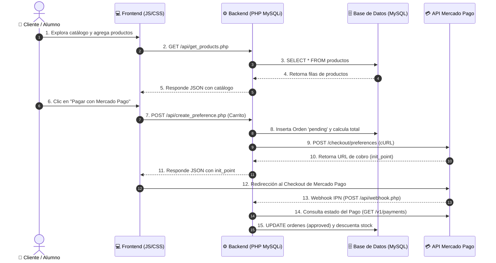

# 📚 Guía Didáctica: Arquitectura y Funcionamiento del Kiosco Online

Esta guía está diseñada como material educativo para estudiantes de desarrollo web full stack. Explica de forma conceptual, técnica y paso a paso cómo interactúan los componentes de una aplicación moderna: **Frontend (HTML/CSS/JS)**, **Backend (PHP MySQLi)**, **Base de Datos Relacional (MySQL)** y una **Pasarela de Pagos (Mercado Pago API)**.

---

## 1. Visión General de la Arquitectura

Una aplicación web **Full Stack** se divide en capas de responsabilidad:



---

## 2. Los 5 Módulos del Sistema Explicados

### Módulo 1: Base de Datos Relacional (MySQL)
La base de datos es la encargada de la **persistencia de datos**. Se compone de 4 tablas relacionadas:

1. **`productos`**: Almacena el inventario (`nombre`, `precio`, **`unidad_medida`**, `categoria`, `stock`, `imagen_url`, `destacado`).
2. **`ordenes`**: Registra cada transacción (`external_reference`, `monto_total`, `estado`, `mp_payment_id`).
3. **`orden_items`**: Tabla de relación (1 a Muchos) que desglosa qué productos y qué cantidad (entera o fraccionaria) componen cada orden.
4. **`usuarios`**: Guarda las credenciales del personal administrador (`username`, `password_hash`).

> **Novedad — Venta por peso:** `productos.unidad_medida` es un `ENUM('unidad','kg','litro')`. El precio y el stock se interpretan según esa unidad (por ejemplo, `$9800` *por kilo*). Para admitir fracciones, `productos.stock` y `orden_items.cantidad` son `DECIMAL(10,3)` (soportan `0.500`, `1.200`, etc.).

> **Concepto para Alumnos (Integridad Referencial):**
> Usamos llaves foráneas (`FOREIGN KEY`) en `orden_items` con `ON DELETE CASCADE`. Si una orden se elimina, sus ítems asociados se eliminan automáticamente para evitar datos huérfanos.

---

### Módulo 2: Backend REST API con PHP y MySQLi (Orientado a Objetos)

El servidor actúa como puente seguro. No confiamos en los precios que envía el navegador del cliente; el backend siempre valida los datos en MySQL usando **MySQLi**.

- **Conexión Segura (MySQLi Singleton)** (`config/database.php`):
  Previene múltiples conexiones innecesarias a la base de datos utilizando el patrón de diseño **Singleton** (`new mysqli(...)`). Activa el reporte estricto de excepciones (`MYSQLI_REPORT_ERROR | MYSQLI_REPORT_STRICT`) y establece el juego de caracteres UTF-8 (`set_charset("utf8mb4")`).

- **Consultas Preparadas con `bind_param()`**:
  Para evitar ataques de **Inyección SQL**, se utiliza `$stmt = $db->prepare(...)` vinculando explícitamente los tipos de datos en `$stmt->bind_param("sdsi", ...)`:
  - `i`: Integer (Entero)
  - `d`: Double / Float (Decimales)
  - `s`: String (Cadenas de texto)
  - `b`: Blob (Binario)

- **Manejo de Transacciones Atómicas (ACID)**:
  Para operaciones complejas como el checkout o el webhook, se delimitan transacciones usando `$db->begin_transaction()`, `$db->commit()` y `$db->rollback()`, garantizando que si falla un paso, no se generen datos inconsistentes.

- **Variables de Entorno con Composer** (`.env` + `vlucas/phpdotenv`):
  Las credenciales sensibles (contraseñas de BD y Access Tokens de Mercado Pago) jamás se escriben en el código fuente, sino que se leen en tiempo de ejecución desde el archivo `.env`.

- **Seguridad en Autenticación** (`config/auth.php` y `api/admin/login.php`):
  Las contraseñas se encriptan con el algoritmo estándar **BCRYPT** (`password_hash()`) y se verifican con `password_verify()`. Al iniciar sesión se regenera el ID de sesión (`session_regenerate_id(true)`) para prevenir ataques de **Session Fixation**.

---

### Módulo 3: Pasarela de Pagos (Mercado Pago API)

Integrar cobros en línea consta de dos etapas clave:

1. **Creación de la Preferencia de Pago** (`api/create_preference.php`):
   - El servidor prepara la lista de ítems (`items`), la referencia de la orden (`external_reference`), las URLs de retorno (`back_urls`) y el punto de notificación (`notification_url`).
   - Se realiza una petición HTTP POST vía **cURL** a la API oficial de Mercado Pago (`https://api.mercadopago.com/checkout/preferences`).
   - Mercado Pago responde con una URL única (`init_point`) a la que se redirige al cliente.

2. **Receptor Webhook / IPN** (`api/webhook.php`):
   - **¿Por qué es necesario?** Un cliente podría cerrar la ventana del navegador antes de regresar al sitio. El Webhook es un mecanismo **Asíncrono (Servidor a Servidor)**.
   - Mercado Pago envía una notificación HTTP a nuestro servidor indicando que un pago cambió de estado.
   - Nuestro backend consulta a Mercado Pago el estado real del pago y, si es `approved`, actualiza la orden en MySQLi y descuenta el stock del inventario.

---

### Módulo 4: Frontend Reactivo en Tiempo Real (HTML5 / CSS3 / JS)

El frontend está desarrollado con tecnologías web estándar sin dependencias pesadas:

- **Diseño Responsive & Glassmorphism** (`public/css/styles.css`):
  Utiliza variables CSS nativas (`:root`), grillas adaptativas (`grid-template-columns: repeat(auto-fill, minmax(260px, 1fr))`) y efectos de desenfoque (`backdrop-filter`).
- **Carrito Reactivo con Patrón Observable** (`public/js/cart.js`):
  El carrito mantiene el estado en tiempo real. Cuando el usuario agrega o quita un producto, se notifica a los suscriptores (`Cart.subscribe()`), actualizando el contador del encabezado, el subtotal y sincronizando los datos en `localStorage`.

---

### Módulo 5: Panel de Administración (CRUD)

Ubicado en `admin/index.php`, permite gestionar el negocio mediante las 4 operaciones **CRUD**:
- **C**reate: Agregar nuevos productos al catálogo mediante el formulario modal.
- **R**ead: Visualizar métricas de ventas y consultar el catálogo o historial de órdenes.
- **U**pdate: Modificar precio, **unidad de medida**, stock o estado destacado de un producto existente.
- **D**elete: Eliminar productos del inventario.

---

## 6. 🧀 Desafío resuelto: Venta por Fracciones de Peso

Este almacén permite vender productos **por unidad** (ej. un sachet de leche) o **por peso/volumen** (ej. 0,5 kg de queso, 1,2 kg de fruta, 0,75 L de vino suelto), con **cálculo automático del precio** según la fracción elegida.

**¿Cómo funciona de punta a punta?**

1. **Base de datos:** cada producto declara su `unidad_medida`. El `precio` es siempre "por esa unidad" (por kg, por litro o por unidad) y el `stock` se guarda como `DECIMAL(10,3)`.
2. **Tienda (frontend):** las tarjetas de productos por peso muestran un selector con botones `−/+` (paso de 0,25) y un campo editable en kg/L, con el **subtotal actualizándose en vivo** (`precio × cantidad`). Dentro del carrito, el peso también se puede editar a mano (ej. tipear `1.2`).
3. **Cálculo seguro en el servidor** (`create_preference.php`): el backend **nunca confía** en el precio del navegador. Vuelve a leer el precio de la base, calcula `subtotal = precio × cantidad` redondeado a 2 decimales y arma la orden.
4. **Compatibilidad con Mercado Pago:** la API de MP exige `quantity` **entero**. Por eso, para un producto por peso enviamos `quantity = 1` y `unit_price = subtotal`, e indicamos el peso en el título del ítem (ej. *"Queso Cremoso (1,2 kg)"*). Así, el total que cobra MP coincide **exactamente** con el total guardado en la orden.
5. **Stock por peso** (`webhook.php`): al aprobarse el pago, el stock se descuenta en decimal (`stock - cantidad`).

> **Concepto para Alumnos:** separar la *unidad de medida* del *precio* es un patrón común en e-commerce real (verdulerías, fiambrerías, ferreterías que venden por metro, etc.). El truco de "colapsar" un ítem por peso en `quantity=1` con el subtotal como `unit_price` es la forma estándar de encajar ventas fraccionadas en pasarelas que solo aceptan cantidades enteras.

---

## 7. ⚙️ Instalación paso a paso (XAMPP + Windows)

1. **Descargar** el proyecto y copiarlo dentro de `C:\xampp\htdocs\` (por ejemplo `C:\xampp\htdocs\2026\Antigravity`).
2. En el **Panel de XAMPP**, iniciar **Apache** y **MySQL**.
3. **Crear la base de datos:** abrir `http://localhost/phpmyadmin`, pestaña *Importar*, y elegir el archivo `db/schema.sql`. Eso crea la base `kiosco_online`, las tablas y los productos de ejemplo.
   - *Si ya tenías la base vieja del Kiosco*, descomentá y ejecutá una sola vez el bloque **MIGRACIÓN** que está al principio de `db/schema.sql`.
4. **Instalar Composer** (desde https://getcomposer.org) y, en la carpeta del proyecto, ejecutar en la terminal:
   ```
   composer require vlucas/phpdotenv
   ```
   Esto crea la carpeta `vendor/` que `env.php` usa para leer el archivo `.env`.
5. **Crear el archivo `.env`:** copiar `env.txt` y renombrar la copia a **`.env`** (con el punto adelante, exactamente ese nombre: `phpdotenv` lee `.env`, no `.env.example`).
6. **Cargar tus credenciales de Mercado Pago** en el `.env` (reemplazando los valores de ejemplo):
   ```
   MP_ACCESS_TOKEN=APP_USR-... (tu Access Token)
   MP_PUBLIC_KEY=APP_USR-...   (tu Public Key)
   BASE_URL=http://localhost/2026/Antigravity
   ```
   Las credenciales se obtienen en: https://www.mercadopago.com.ar/developers/es/docs/your-integrations/credentials
   > Podés empezar con las credenciales de **prueba (TEST-...)** para simular pagos sin dinero real.
7. **Probar la tienda (cliente):** `http://localhost/2026/Antigravity/index.php`
8. **Probar el panel (admin):** `http://localhost/2026/Antigravity/admin/index.php`
   - Usuario: `admin` — Contraseña: `admin123`
9. **Adaptar el negocio:** desde el panel de admin, cargá/editá productos eligiendo su **unidad de medida** (unidad, kg o litro), precio y stock.

> **Nota sobre el Webhook:** en `localhost` Mercado Pago no puede llamar a tu `webhook.php` (no es accesible desde internet). El código ya contempla esto y omite el `notification_url` en localhost. Para probar el webhook real necesitás publicar el sitio en un dominio público con HTTPS (o usar una herramienta de túnel).

---

